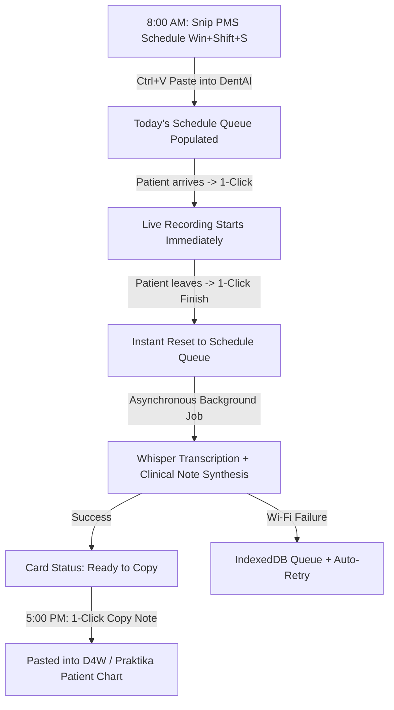

# Statement of Intent: Daily PMS Schedule Queue & Background Scribe

## Overview
A zero-friction, uninterrupted daily workflow for Australian dental practices running Practice Management Software (PMS) such as Dental4Windows (D4W) and Praktika. 

Instead of manual patient intake and blocking post-consult review screens, clinicians snip/paste their morning appointment book once, record consultations with 1 click per patient, let clinical notes generate silently in the background, and batch-copy notes into their PMS at the end of the day.

---

## Intent Specification

- **Outcome:** A morning snip-to-schedule Day Queue where dentists tap "Record" against each patient on their roster, notes synthesize asynchronously in the background, and completed notes are 1-click copied into D4W/Praktika at 5:00 PM.
- **User:** Associate dentists, practice principals, and dental assistants handling 8–15 back-to-back consultations daily in fast-paced dental surgeries.
- **Why Now:** Pilot feedback revealed that requiring manual patient intake (DOB, names, wizard steps) and forcing clinicians through post-consult review/save screens breaks chairside turnaround (which is typically only 3–4 minutes between patients).
- **Success Criteria:** 
  1. Complete elimination of manual intake entry during patient hours.
  2. Total transition time from patient dismissal to next patient recording < 5 seconds.
  3. 100% of notes synthesized and ready for batch PMS transfer at the end of the day, with zero lost audio even during Wi-Fi drops.
- **Constraints:** 
  - Zero required intake fields (no DOB, phone, or email needed to start).
  - No blocking review/save screens after clicking "Finish" on a recording.
  - Mandatory local audio persistence (IndexedDB) prior to network transmission to guarantee resilience against connection dropouts.
  - Multi-provider schedule resilience (support for single-column snips and emergency walk-ins).
- **Out of Scope:** 
  - Direct reverse-engineering or direct SQL/API writing into D4W/Praktika on-premise proprietary databases (handled via 1-click clipboard paste).
  - Multi-chair real-time bi-directional PMS calendar synchronization.

---

## The 4-Stage Clinical Flow

### 1. Morning Setup (5 Seconds)
- The clinician or dental assistant uses Windows Snipping Tool (`Win + Shift + S`) to capture their provider appointment column in D4W or Praktika.
- In DentAI, pressing `Ctrl + V` or dropping the image instantly runs OCR/Vision parsing.
- Today's appointment roster is populated chronologically (Time, Patient Name, Procedure Reason, Template Auto-Assignment).
- Clinicians can quickly add unscheduled emergency walk-ins via a 1-field `[ + Quick Add ]` button.

### 2. Chairside Execution (Zero Friction)
- When the patient enters surgery, the clinician clicks `[ Record ]` on that patient's appointment card.
- DentAI launches straight into ambient recording with patient metadata pre-bound—no 3-step intake wizard, no DOB prompts.

### 3. Immediate Turnaround & Background Synthesis
- When active treatment concludes, the clinician taps `[ Finish Consult ]`.
- DentAI immediately writes the full raw audio blob into local `IndexedDB` storage.
- The UI immediately returns to the Day Schedule so the assistant and dentist can prep the room for the next patient.
- Transcription (Whisper), FDI tooth charting, ADA code extraction, and clinical note generation run entirely in the background.

### 4. End-of-Day Batch PMS Transfer (5:00 PM)
- The dentist opens the Day Schedule at the end of their shift.
- Each appointment displays a prominent `[ Copy Clinical Note ]` button.
- The dentist clicks "Copy", switches to D4W/Praktika, and pastes (`Ctrl + V`) into the patient's record.
- Notes are marked as "Transferred / Completed".

---

## Resilience & Silent Failure Safeguards

1. **Local Audio Vault:** Audio is saved to browser IndexedDB before network dispatch.
2. **Visible Status Badges:**
   - ⚪ `Scheduled`
   - 🔴 `Live Recording`
   - 🟡 `Generating Notes...`
   - 🟢 `Ready to Copy`
   - 🟠 `Retrying (Network Reconnecting)`
   - 🔴 `Action Required`
3. **Automatic Retries:** Background retry queue with exponential backoff on network dropouts.
4. **Safety Net Bar:** Header summary showing total progress (e.g. *"9 of 10 notes ready for D4W • 1 retrying"*) with 1-click scroll to any flagged item.
