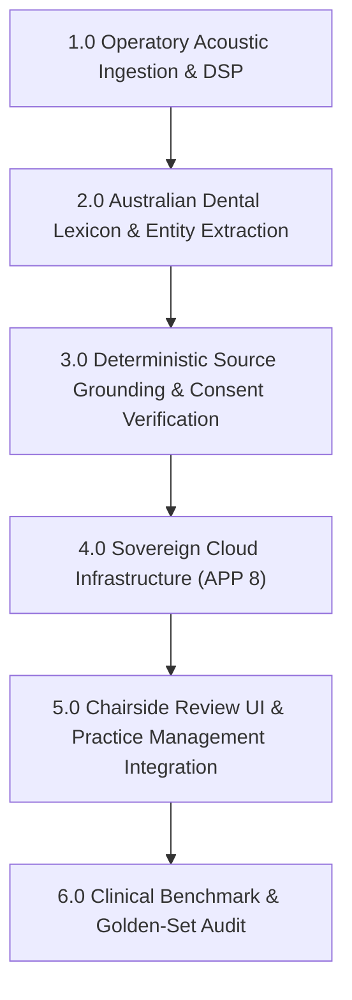

# Work Breakdown Structure (WBS): Clinical Accuracy Engine for Australian Dental Practices

**Project Objective:** Deliver a deterministic, AHPRA-aligned, auditable speech-to-clinical-documentation pipeline adhering to the Dental Board of Australia (DBA) Code of Conduct, Australian Privacy Principle 8 (APP 8), and *Rogers v Whitaker* informed consent evidentiary standards.

---



---

## 1.0 Operatory Acoustic Ingestion & Pre-Processing (DSP)

*Objective: Capture clean, high-SNR operatory speech while eliminating acoustic artifacts unique to dental operatories.*

* **1.1 Input Audio Pipeline & Hardware Guidelines**
  * **1.1.1** Mandate and validate near-field directional mic input (16 kHz mono, 16-bit PCM / Opus stream).
  * **1.1.2** Implement client-side Voice Activity Detection (VAD) with aggressive speech-segment chunking (3–10 s windowing).
  * **1.1.3** Prevent Web Speech API usage; decouple audio streaming directly to the backend processing gateway.

* **1.2 Operatory-Specific Digital Signal Processing (DSP)**
  * **1.2.1** High-pass Butterworth filter at 80 Hz to eliminate HVAC and mechanical compressor low-frequency rumble.
  * **1.2.2** Parametric notch filter centered at **5,000 Hz – 7,500 Hz** (Q = 6–8) to attenuate high-speed air-turbine handpiece whine (300,000–450,000 RPM fundamental frequency).
  * **1.2.3** High-frequency shelf roll-off at 18 kHz to strip ultrasonic scaler sub-harmonics and cavitation hiss.
  * **1.2.4** Real-time Signal-to-Noise Ratio (SNR) checker; emit a client-side warning if SNR drops below 12 dB.

---

## 2.0 Australian Dental Lexicon, FDI Engine & Clinical Entity Extraction

*Objective: Deterministically extract and validate Australian dental terminology, notation, and pharmacology.*

* **2.1 ISO 3950 / FDI Two-Digit Notation Disambiguation**
  * **2.1.1** Regex and finite-state engine enforcing FDI range constraints:
    * Permanent dentition: Quadrants 1–4, Teeth 11–48.
    * Deciduous dentition: Quadrants 5–8, Teeth 51–85.
  * **2.1.2** Spoken-number disambiguation rules (e.g., distinguishing *"one six"* [16] vs. *"one, six"* vs. tooth surface notations).
  * **2.1.3** Anatomical surface validation per tooth type (Incisal vs. Occlusal; Mesial, Distal, Buccal/Facial, Lingual/Palatal).

* **2.2 ADA Schedule Item Mapping (Australian Dental Association)**
  * **2.2.1** Core 50 high-frequency item code mapper:
    * **Diagnostic**: 011, 012, 013, 022, 071.
    * **Periodontal**: 221, 222 (Pocket depth charting sequence parser: 6-point probing).
    * **Restorative multi-surface extraction**: Direct composite/amalgam (Items 521–535 based on tooth and surface count, e.g., `16 MOD` $\rightarrow$ Item 533).
    * **Surgical/Exodontia**: 311, 314, 322, 324.

* **2.3 High-Risk Pharmacology Alerts (Medicolegal Risk Rules)**
  * **2.3.1** Antiresorptive & antiangiogenic detector (Bisphosphonates, Denosumab/Prolia) $\rightarrow$ trigger MRONJ warning on planned surgical/extraction items.
  * **2.3.2** Anticoagulant & antiplatelet detector (Warfarin, Apixaban/Eliquis, Rivaroxaban/Xarelto, Clopidogrel) $\rightarrow$ trigger hemostasis/INR verification warning.
  * **2.3.3** Local anaesthetic dosage calculator (Lignocaine 2% with 1:80k adrenaline, Articaine 4% with 1:100k adrenaline) checking maximum recommended doses by patient weight.

---

## 3.0 Deterministic Source Grounding & Evidentiary Verification

*Objective: Guarantee auditability and eliminate hallucinations by linking every clinical assertion to source audio.*

* **3.1 Sub-Second Utterance Grounding (Forward Verification)**
  * **3.1.1** Generate timestamped utterance offsets (start/end millisecond arrays) for all ASR tokens.
  * **3.1.2** Bind every extracted clinical entity (Tooth, Surface, Finding, Drug, Item Code) to its corresponding audio segment ID.
  * **3.1.3** Compute deterministic token confidence scores (0.00–1.00); flag any assertion falling below 0.85 for chairside review.

* **3.2 Reconciliation Engine (Backward Verification)**
  * **3.2.1** Cross-reference raw clinical entity mentions against synthesized note sections.
  * **3.2.2** Mark omitted items (e.g., spoken allergy not present in summary) as critical reconciliation warnings.

* **3.3 *Rogers v Whitaker* Evidentiary Consent Gate**
  * **3.3.1** Detect chairside discussion of patient-specific material risks (e.g., nerve paresthesia for lower third molars, sinus involvement for upper premolars/molars).
  * **3.3.2** Strict prohibition of auto-inserting generic or boilerplate consent text; only documented risks with verified audio backing are transcribed.

---

## 4.0 Sovereign Cloud Architecture & Compliance (APP 8)

*Objective: Ensure all Protected Health Information (PHI) complies with Australian privacy and cloud residency mandates.*

* **4.1 Sydney-Sovereign API Infrastructure**
  * **4.1.1** Route all processing through Google Cloud Vertex AI / Cloud Run in Sydney (`australia-southeast1`).
  * **4.1.2** Enforce strict data non-retention agreements: zero persistence of raw audio payloads on external model servers for training.

* **4.2 In-Flight & At-Rest Encryption**
  * **4.2.1** TLS 1.3 for all streaming WebSockets and HTTPS payloads.
  * **4.2.2** AES-256-GCM encryption for temporary session audio chunks and generated JSON records.

* **4.3 Structured Note Generation Pipeline**
  * **4.3.1** Constrained schema generation enforcing strict clinical JSON output:
```json
{
  "patient_context": { "alerts": [] },
  "soap_note": {
    "subjective": "",
    "objective": { "charting": [], "perio": [] },
    "assessment": [],
    "plan": []
  },
  "ada_items": [],
  "citations": [{ "field": "", "audio_start_ms": 0, "audio_end_ms": 0, "confidence": 0.0 }]
}
```

---

## 5.0 Chairside Review UI & Workflow Integration

*Objective: Enable friction-free clinician validation within 30 seconds post-encounter.*

* **5.1 Interactive Verification Interface**
  * **5.1.1** Render color-coded confidence badges across SOAP note fields:
    * Green: $\ge 0.90$ confidence.
    * Amber: $0.70 - 0.89$ confidence (requires explicit practitioner confirmation).
    * Red: $< 0.70$ or phonetic conflict.
  * **5.1.2** 1-Tap Audio Chip playback: clicking on any finding or tooth number immediately plays the corresponding raw audio segment.

* **5.2 Audit Logging & Clinician Attestation**
  * **5.2.1** Cryptographic hashing (SHA-256) of finalized clinical notes with timestamp and registered practitioner ID.
  * **5.2.2** Append-only modification logs preserving raw transcript, AI-proposed draft, and manual doctor edits for court defensibility.

* **5.3 Practice Management Software (PMS) Clipboard Bridge**
  * **5.3.1** One-click formatted export compatible with leading Australian PMS solutions:
    * Centaur Software (Dental4Windows / D4W).
    * Software of Excellence (EXACT).
    * Core Practice / Dentally.

---

## 6.0 Clinical Benchmark & Golden-Set Audit

*Objective: Empirically validate accuracy against real-world Australian clinical operatories.*

* **6.1 Australian Dental Gold-Standard Audio Test Harness**
  * **6.1.1** 20 multi-condition operatory test recordings covering:
    * Broad Australian accents and ESL clinicians.
    * Masked/PPE speech vs. unmasked speech.
    * Active background handpiece and suction noise.

* **6.2 Quantitative Target Metrics**
  * **6.2.1** Clinical Entity Word Error Rate (WER) $\le 3.5\%$.
  * **6.2.2** FDI Tooth Number Precision/Recall $\ge 99.0\%$.
  * **6.2.3** Critical Pharmacology Alert Sensitivity $= 100\%$ across gold-set test cases.
  * **6.2.4** Average chairside note delivery latency $< 4.0$ seconds post-recording completion.
