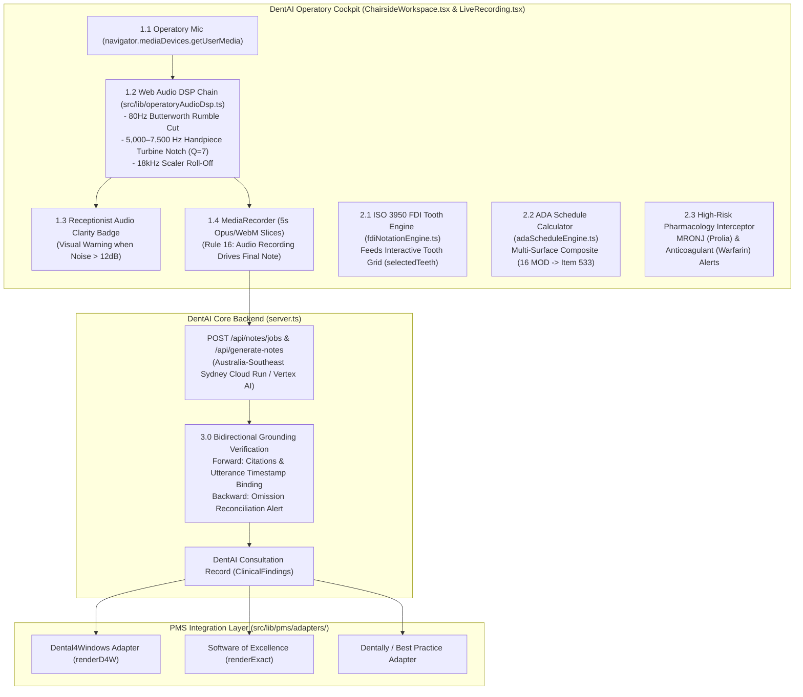

# Work Breakdown Structure (WBS): Clinical Accuracy Engine for DentAI

**Project Objective:** Deliver a deterministic, AHPRA-aligned, auditable speech-to-clinical-documentation pipeline natively integrated into the **DentAI Operatory Cockpit** ([`ChairsideWorkspace.tsx`](file:///c:/Users/swati/Downloads/dentai/src/components/ChairsideWorkspace.tsx)), adhering to the Dental Board of Australia (DBA) Code of Conduct, Australian Privacy Principle 8 (APP 8), and *Rogers v Whitaker* informed consent evidentiary standards.

---

## DentAI Architecture & Integration Topology

---

## 1.0 Operatory Acoustic Ingestion & Pre-Processing (DSP)
*DentAI Target Files: `src/lib/operatoryAudioDsp.ts`, `src/components/ChairsideWorkspace.tsx`, `src/components/LiveRecording.tsx`*

* **1.1 Native Audio Pipeline Integration (`getUserMedia` Lifecycle)**
  * **1.1.1** Intercept the existing `navigator.mediaDevices.getUserMedia` stream inside `ChairsideWorkspace.tsx` (lines 950–995) and `LiveRecording.tsx` (lines 315–335).
  * **1.1.2** Instantiate an `AudioContext` and insert the DentAI Operatory DSP chain prior to pipe handover.
  * **1.1.3** Decouple final note generation from consumer `webkitSpeechRecognition`: Web Speech API remains exclusively for the live ambient UI transcript ticker, while the DSP-filtered stream drives the 5-second `MediaRecorder` chunk upload pipeline (satisfying **Rule 16**).
  * **1.1.4 Cross-Patient Teardown (Rule 14)**: Bind DSP lifecycle to `activeEncounter.id`. When a patient transition occurs (via Daysheet queue selection or `Next Patient` hotkey), call `dsp.destroy()`, reset the audio stream, and enforce `STANDBY` mode.

* **1.2 Operatory-Specific Digital Signal Processing Chain (`src/lib/operatoryAudioDsp.ts`)**
  * **1.2.1 80 Hz Low-Rumble Cut**: 2nd-order Butterworth high-pass filter (`type: 'highpass'`, `frequency: 80`, `Q: 0.707`) to eliminate compressor and suction hum.
  * **1.2.2 5,000 Hz – 7,500 Hz Handpiece Turbine Notch Filter**: Parametric notch filter (`type: 'notch'`, `frequency: 6250`, `Q: 7.0`) specifically tuned to suppress the resonant acoustic whine of high-speed air turbines (300,000–450,000 RPM) without distorting dental vocal frequencies.
  * **1.2.3 18 kHz Scaler Roll-Off**: Low-pass filter (`type: 'lowpass'`, `frequency: 18000`, `Q: 0.707`) stripping ultrasonic scaler cavitation noise.

* **1.3 Receptionist-Friendly Live Audio Clarity Checker (SNR Monitor)**
  * **1.3.1** Tap an `AnalyserNode` off the filtered stream to calculate rolling Signal-to-Noise Ratio (SNR).
  * **1.3.2 Anti-Jargon Standard (Rule 9)**: If SNR falls below 12 dB, emit a receptionist-friendly chairside alert in `ChairsideWorkspace.tsx`:
    `"Microphone Notice: Operatory background noise is high. Please position microphone closer to speaker."` (No engineering jargon like "DSP squelch" or "12 dB SNR degradation").
  * **1.3.3 Non-Intrusive Layout (Rule 4 & Rule 8)**: Position the audio clarity indicator cleanly adjacent to the 3-minute silence countdown timer without blocking operatory control panels or keyboard shortcuts.

---

## 2.0 Australian Dental Lexicon, FDI Engine & Clinical Entity Extraction
*DentAI Target Files: `src/lib/fdiNotationEngine.ts`, `src/lib/adaScheduleEngine.ts`, `src/lib/pharmacologySafetyEngine.ts`, `src/lib/dentalPhoneticLexicon.ts`*

* **2.1 ISO 3950 / FDI Two-Digit Notation Disambiguation**
  * **2.1.1 Strict ISO 3950 Range Enforcement**:
    * Permanent dentition: Quadrants 1–4, Teeth 11–48.
    * Deciduous dentition: Quadrants 5–8, Teeth 51–85.
    * Automatic rejection of invalid tooth integers (e.g. 19, 29, 39, 49, 91–98).
  * **2.1.2 Spoken Dialogue Disambiguation**:
    * Map conversational expressions (`"tooth one six"`, `"upper right first molar"`, `"upper right six"`) &rarr; strictly `Tooth 16`.
    * Disambiguate lists from numbers: `"teeth one, six"` &rarr; `[11, 16]` vs. `"tooth one six"` &rarr; `[16]`.
  * **2.1.3 Integration with Cockpit Interactive Tooth Grid**:
    * Feeds directly into `activeTooth` and `selectedTeeth` state in `ChairsideWorkspace.tsx`, auto-selecting teeth mentioned during speech.
  * **2.1.4 Anatomical Surface Validation**:
    * Posterior (Molars/Premolars): `M, O, D, B, L/P`.
    * Anterior (Incisors/Canines): `M, I, D, B/F, L/P` (rejects impossible surfaces like Occlusal on tooth 11).

* **2.2 ADA Schedule Item Mapping (Australian Dental Association)**
  * **2.2.1 Core 50 High-Frequency Item Mapper**:
    * Diagnostic: 011 (Comprehensive Exam), 012 (Periodic), 013 (Emergency Triage), 022 (Periapical X-Ray), 071 (Diagnostic Model).
    * Preventative & Periodontal: 114 (Scale & Clean), 121 (Fluoride), 221 (Clinical Periodontal Analysis), 222 (Root Planing).
    * Surgical & Exodontia: 311 (Extraction), 314 (Sectional Extraction), 322 (Surgical Removal with Bone Division).
  * **2.2.2 Multi-Surface Restorative Calculator (Items 521–535)**:
    * Dynamically computes item code from tooth type + surface count:
      * Posterior Composite: 1 surface (`531`), 2 surfaces (`532`), 3 surfaces (`533`), 4 surfaces (`534`), 5 surfaces (`535`).
      * Example: Spoken `"tooth 16 mesial occlusal distal composite"` &rarr; Extracts `Tooth 16`, surfaces `MOD`, assigns ADA Item `533`.
  * **2.2.3 Seamless Findings Integration**:
    * Populates `Consultation.findings.adaCodes` array with `{ code, description, tooth }`, directly feeding the D4W and EXACT clipboard exporters.
  * **2.2.4 Zero Billing Hallucination (Rule 12)**:
    * Billing codes are never guessed or inferred from casual fee mentions; only clinically documented procedures generate ADA item codes.

* **2.3 High-Risk Pharmacology Alerts (Medicolegal Risk Rules)**
  * **2.3.1 MRONJ Antiresorptive Interceptor**:
    * Detects Bisphosphonates (Alendronate/Fosamax, Zoledronic acid) and Denosumab (Prolia/Xgeva).
    * When detected alongside surgical or extraction items (`311`, `314`, `322`), automatically triggers high-priority alert in the `ChairsideWorkspace` Patient Header:
      `"⚠️ MRONJ Alert: Patient on antiresorptive therapy (Prolia/Bisphosphonates). Document informed consent and surgical risks."`
  * **2.3.2 Anticoagulant & Hemostasis Interceptor**:
    * Detects Warfarin, Apixaban (Eliquis), Rivaroxaban (Xarelto), Clopidogrel (Plavix), Aspirin.
    * Injects hemostasis and post-op bleeding precautions into the draft findings.
  * **2.3.3 Local Anaesthetic Weight-Based Dosage Calculator**:
    * Tracks spoken cartridges of Lignocaine 2% (1:80,000 adrenaline) and Articaine 4% (1:100,000 adrenaline).
    * Calculates exact mg and mcg delivered; compares against maximum recommended limits based on patient weight.

---

## 3.0 Deterministic Source Grounding & Evidentiary Verification
*DentAI Target Files: `src/lib/transcriptGrounding.ts`, `server.ts`, `src/lib/draftEngine.ts`*

* **3.1 Sub-Second Utterance Grounding (Forward Verification)**
  * **3.1.1** Bind every extracted clinical finding (Tooth, Surface, Finding, Drug, Item Code) to its corresponding audio slice ID and millisecond timestamp.
  * **3.1.2** Compute deterministic grounding scores (0.00–1.00). Findings with confidence $< 0.85$ are flagged in amber for chairside clinician verification.
  * **3.1.3 Receptionist-Friendly Grounding Badge (Rule 9)**:
    * Display `"Verified from Audio"` badge in the cockpit instead of technical jargon like "100% grounded / 0 hallucination vectors".

* **3.2 Reconciliation Engine (Backward Verification — Zero Omission)**
  * **3.2.1** Cross-reference all raw clinical entity mentions (spoken allergies, systemic diseases, teeth discussed) against the generated note sections.
  * **3.2.2** If a spoken medical alert (e.g. `"allergic to penicillin"` or `"taking blood thinners"`) is missing from the synthesized note, block final sign-off with an urgent reconciliation alert.

* **3.3 *Rogers v Whitaker* Evidentiary Consent Gate**
  * **3.3.1** Capture actual operatory discussion of patient-specific material risks (bleeding, bruising, nerve paresthesia, post-op sensitivity).
  * **3.3.2 Zero-Fabrication Rule (Rule 12)**:
    * Prohibit auto-inserting canned boilerplate consent clauses. The consent section records *only* the specific risks verbally discussed between the clinician and patient.

---

## 4.0 Sovereign Cloud Architecture & Compliance (APP 8)
*DentAI Target Files: `server.ts`, `src/lib/noteModelConfig.ts`, `src/server/payloadValidation.ts`*

* **4.1 Sydney-Sovereign API Infrastructure**
  * **4.1.1** Route all processing through Google Cloud Vertex AI / Cloud Run in Sydney (`australia-southeast1`), ensuring Australian health data sovereignty under APP 8.
  * **4.1.2 Data Non-Retention Policy**: Enforce zero persistence of raw audio payloads on external AI model servers.
  * **4.1.3 Multi-Provider Redundancy Router**:
    * Primary: Vertex AI Sydney (`gemini-2.5-flash`).
    * Secondary: Anthropic Claude 3.5 Sonnet / AWS Bedrock (Sydney).
    * Tertiary: On-premise local server (`llama-server` on clinic LAN GPU).
    * Automatic circuit breaker on `429 Too Many Requests` with seamless failover and zero user-facing crash.

* **4.2 Deterministic Structured Offline Scribing Engine V2 (`draftEngine.ts`)**
  * **4.2.1** If all cloud routes fail, trigger DentAI’s deterministic offline draft engine.
  * **4.2.2** Structure findings into clean, professional clinical bullets (SOAP & D4W sections) rather than verbatim dialogue dumps.
  * **4.2.3 Full Stutter Loop Suppression**: Apply multi-pass prefix deduplication and progressive stutter collapse to eliminate repeating phrases.

* **4.3 In-Flight & At-Rest Security**
  * **4.3.1** Enforce TLS 1.3 for all streaming WebSockets and API requests.
  * **4.3.2** Apply AES-256-GCM encryption for temporary session audio chunks and generated JSON records.

---

## 5.0 Chairside Review UI & Practice Management Integration
*DentAI Target Files: `src/components/ChairsideWorkspace.tsx`, `src/lib/pms/adapters/d4w.ts`, `src/lib/pms/adapters/exact.ts`*

* **5.1 Interactive Verification Interface in ChairsideWorkspace**
  * **5.1.1 Color-Coded Confidence Badging**:
    * Green ($\ge 0.90$): Audio-verified assertion.
    * Amber ($0.70 - 0.89$): Clinician confirmation requested.
    * Red ($< 0.70$): Unverified assertion or phonetic ambiguity.
  * **5.1.2 1-Tap Audio Chip Playback**:
    * Clicking any clinical claim in the note review immediately plays the exact 5-second audio slice from the operatory recording.

* **5.2 Audit Logging & Clinician Attestation**
  * **5.2.1 Cryptographic Signing (SHA-256)**:
    * Hash finalized clinical notes with timestamp and registered practitioner ID upon clicking `"Sign & Verify Note"`.
  * **5.2.2 Append-Only Revision History (Rule 11)**:
    * Any post-sign-off edits preserve an immutable revision trail showing the raw transcript, initial AI draft, and clinician edits for court defensibility.

* **5.3 PMS Clipboard Bridge (D4W & EXACT)**
  * **5.3.1 Centaur Software (Dental4Windows / D4W)**:
    * Formats note directly for the D4W 3D Charting & Clinical Notes tab using [`renderD4W`](file:///c:/Users/swati/Downloads/dentai/src/lib/pms/adapters/d4w.ts).
  * **5.3.2 Software of Excellence (EXACT)**:
    * Formats SOAP tabs using [`renderExact`](file:///c:/Users/swati/Downloads/dentai/src/lib/pms/adapters/exact.ts).
  * **5.3.3 Receptionist-Friendly Copy All (Rule 9)**:
    * Primary button labelled `"Copy Note for PMS"` (avoiding technical terms like "Master Export").

---

## 6.0 Clinical Benchmark & Golden-Set Audit
*DentAI Target Files: `tests/ahpraClinicalAccuracy.test.ts`, `tests/dentalLexicon.test.ts`, `tests/fdiNotationEngine.test.ts`*

* **6.1 Australian Dental Gold-Standard Audio Test Harness**
  * **6.1.1** 20 multi-condition operatory test recordings covering:
    * Broad Australian accents and ESL clinicians.
    * Masked/PPE speech vs. unmasked speech.
    * Active background handpiece and suction noise.

* **6.2 Quantitative Target Metrics**
  * **6.2.1** Clinical Entity Word Error Rate (WER) $\le 3.5\%$.
  * **6.2.2** FDI Tooth Number Precision/Recall $\ge 99.0\%$.
  * **6.2.3** Critical Pharmacology Alert Sensitivity $= 100\%$ across gold-set test cases.
  * **6.2.4** Average chairside note delivery latency $< 4.0$ seconds post-recording completion.
